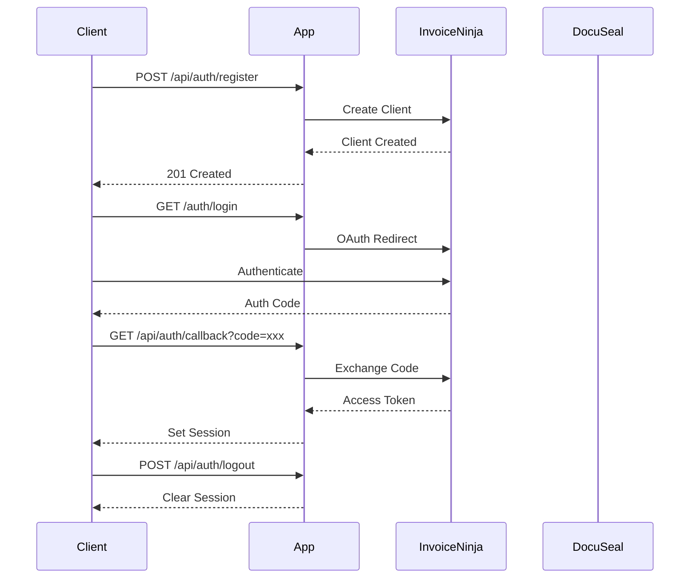
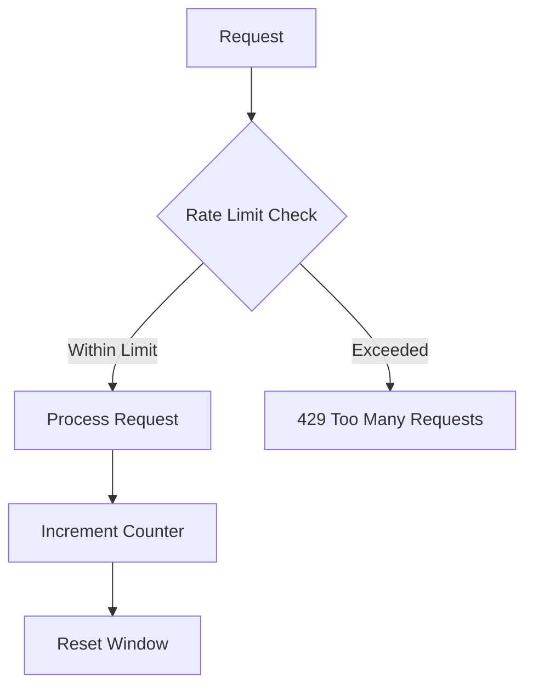

# API Documentation

> For development setup, see [Development Guide](../development/README.md).
> For production deployment, see [Deployment Guide](../deployment/guide.md).

## Authentication Flow



## Authentication

### Register User

`POST /api/auth/register`

> **Security Note**: All endpoints are protected by [CSRF tokens](#csrf-protection) and [rate limiting](#rate-limits).

Registers a new user and creates corresponding client in Invoice Ninja.

**Example Request:**

```bash
curl -X POST https://api.example.com/api/auth/register \
  -H "Content-Type: application/json" \
  -d '{
    "name": "John Doe",
    "email": "john@example.com",
    "phone": "+1234567890",
    "website": "https://example.com",
    "address1": "123 Main St",
    "city": "New York",
    "state": "NY",
    "postalCode": "10001",
    "countryId": "US",
    "contacts": [{
      "firstName": "Jane",
      "lastName": "Doe",
      "email": "jane@example.com",
      "isPrimary": true
    }]
  }'
```

**Example Success Response:**

```json
{
  "message": "Registration successful",
  "user": {
    "id": "user_123",
    "email": "john@example.com",
    "name": "John Doe"
  }
}
```

**Example Error Response:**

```json
{
  "error": "Validation failed",
  "errors": {
    "email": ["Invalid email format"],
    "contacts": ["At least one contact is required"]
  }
}
```

### OAuth Callback

`GET /api/auth/callback`

Handles OAuth callback from Invoice Ninja.

**Query Parameters:**

- `code`: OAuth authorization code
- `error`: Error message if authentication failed

**Success Response:**

- Redirects to `/`
- Sets session cookie
- Status Code: 302

**Error Response:**

- Redirects to `/auth/login?error={error}`
- Status Code: 302

### Logout

`POST /api/auth/logout`

Logs out the current user and clears session data.

**Example Request:**

```bash
curl -X POST https://api.example.com/api/auth/logout \
  -H "Cookie: invoice_ninja_session=xxx"
```

## Document Management

### Upload Document

`POST /api/docuseal/documents`

> **Note**: See [Development Guide](../development/README.md#database-development) for local DocuSeal setup.

Uploads a document to DocuSeal for processing.

**Example Request:**

```bash
curl -X POST https://api.example.com/api/docuseal/documents \
  -H "Authorization: Bearer xxx" \
  -F "document=@contract.pdf" \
  -F "title=Contract Agreement" \
  -F "description=Standard contract template" \
  -F "tags[]=legal" \
  -F "tags[]=contract"
```

**Example Success Response:**

```json
{
  "id": "doc_123",
  "message": "Document uploaded successfully"
}
```

### Get Document Status

`GET /api/docuseal/documents/:id`

Retrieves the status of a document.

**Example Request:**

```bash
curl -X GET https://api.example.com/api/docuseal/documents/doc_123 \
  -H "Authorization: Bearer xxx"
```

**Example Success Response:**

```json
{
  "status": "processing",
  "message": "Document is being processed"
}
```

## Security

### CSRF Protection

All non-GET requests require a CSRF token in the header:

```env
X-CSRF-Token: <token>
```

### Rate Limits



- Default: 100 requests per minute per IP
- Burst: 10 requests per second
- Document Upload: 5 requests per minute per user

### Error Handling

All errors follow a consistent format:

```typescript
{
  error: string;          // Human-readable error message
  errors?: Record<string, string[]>;  // Field-specific validation errors
}
```

### Response Headers

All responses include security headers:

```http
Content-Security-Policy: default-src 'self'
X-Frame-Options: DENY
X-Content-Type-Options: nosniff
Referrer-Policy: strict-origin-when-cross-origin
Strict-Transport-Security: max-age=31536000; includeSubDomains
```

## Testing

> See [Development Guide](../development/README.md#testing--quality-assurance) for testing procedures.

```bash
# Run API tests
npm test -- tests/api/
```
